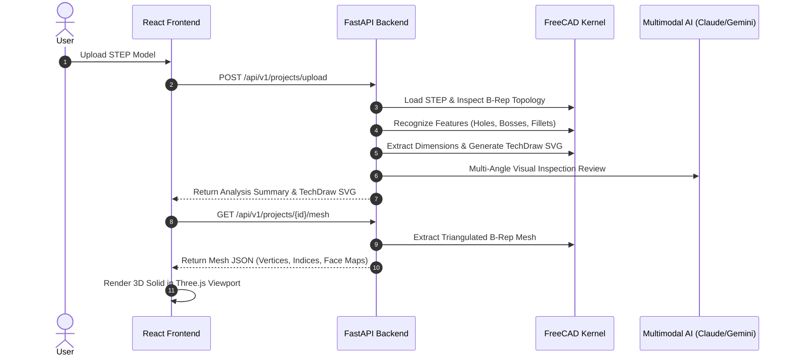
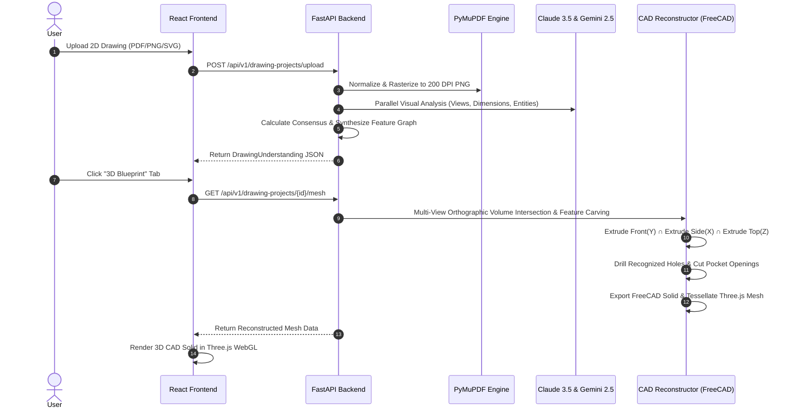

# CAD Intelligence & 2D-to-3D Engineering Platform — Complete Project Documentation

## 1. Executive Overview

The **CAD Intelligence & 2D-to-3D Engineering Platform** is an enterprise-grade, deterministic CAD and multimodal AI system built on **FreeCAD / OpenCASCADE (OCCT)**, **FastAPI**, **React 18**, **TypeScript**, and **Three.js**.

The platform operates across two unified industrial pipelines:

```
┌──────────────────────────────────────────────────────────────────────────────────────────────────┐
│                                 CAD INTELLIGENCE PLATFORM                                        │
├─────────────────────────────────────────────┬────────────────────────────────────────────────────┤
│   USE CASE 1: 3D CAD (STEP) → 2D DRAWING    │      USE CASE 2: 2D DRAWING → 3D BLUEPRINT         │
├─────────────────────────────────────────────┼────────────────────────────────────────────────────┤
│ • Native FreeCAD/OCCT B-Rep Topology        │ • Ingestion of PDF, PNG, JPEG, SVG Drawings        │
│ • Geometric Classification (Planes/Cylinders│ • PyMuPDF (fitz) High-DPI Vector/Raster Rendering  │
│ • Feature Recognition (Holes, Bosses, Ribs) │ • Dual Multimodal AI Analysis (Claude & Gemini)    │
│ • Complete Dimensioning & View Placement    │ • Consensus Resolution & Geometric Validation      │
│ • TechDraw SVG Engineering Drawings         │ • Feature Graph & Parametric Synthesis             │
│ • Dual-Model Multimodal AI Engineering Audit│ • Pure Multi-View Orthographic 2D-to-3D Reconstruct│
│ • Rule-Based Issue & Recommendation Engine  │ • FreeCAD Solid Generation & Three.js 3D Viewport  │
└─────────────────────────────────────────────┴────────────────────────────────────────────────────┘
```

### 1.1. Core Engineering Principle: Strict Evidence-Based Drawing Interpretation (Non-Invention Rule)

The system operates as an **ENGINEERING DRAWING INTERPRETER**, not a creative 3D designer:
- **Zero Invention**: The platform never designs, imagines, beautifies, approximates, or invents 3D features. Accuracy is strictly prioritized over completeness.
- **Strict Evidence Requirement**: A 3D feature is synthesized ONLY when directly supported by explicit drawing evidence:
  1. An explicit dimension callout.
  2. A visible geometric entity (circle, edge, slot, polygon).
  3. A clearly identifiable projection in an orthogonal view (Front, Top, Side).
  4. Cross-view geometric correlation.
- **Strict Evidence Chain Architecture**:
  ```
  Multimodal AI (Claude 3.5 / Gemini 2.5)
  ↓ [Extract verifiable facts only]
  Structured JSON + Bounding Boxes + Evidence IDs
  ↓ [Filter & reject ungrounded/ambiguous features]
  Deterministic Validator (DrawingValidator)
  ↓ [Generate strict CAD-neutral execution recipe]
  Reconstruction Planner (ReconstructionPlanner)
  ↓ [Execute exact OpenCASCADE CSG volume intersection]
  FreeCAD / OpenCASCADE Engine (CADReconstructor)
  ```
- **Ambiguity Transparency**: When depth, height, or positional constraints are missing from the drawing, the system flags the feature as `ambiguous: true` with `reconstruction_status: INSUFFICIENT_INFORMATION` rather than fabricating arbitrary geometry.

---

## 2. Technology Stack

### Backend
- **Language & Runtime**: Python 3.11
- **CAD Kernel**: FreeCAD 1.1 / OpenCASCADE Technology (OCCT)
- **Web API**: FastAPI, Uvicorn, Pydantic v2
- **Document & Vector Rendering**: PyMuPDF (`fitz`), SVG / XML parsers
- **Multimodal AI**: Anthropic Claude 3.5 Sonnet (`anthropic` SDK), Google Gemini 2.5 Flash (`google-genai` SDK)

### Frontend
- **Framework & Build**: React 18, Vite 6, TypeScript 5
- **3D WebGL Engine**: Three.js, `@react-three/fiber`, `@react-three/drei`
- **Styling & UI**: Tailwind CSS, Lucide Icons, Glassmorphism design tokens
- **HTTP Client**: Axios with full TypeScript API contracts

---

## 3. System Architecture & Module Breakdown

### 3.1. CAD Core Engine (`src/cad/`)
Provides native OpenCASCADE B-Rep inspection, exact geometric calculations, and FreeCAD TechDraw integration:

| Module | Responsibility |
| :--- | :--- |
| `freecad_env.py` | Auto-detects FreeCAD 1.1 / 1.0 installation paths, sets DLL directories, and binds FreeCAD python binaries. |
| `step_loader.py` | Loads `.step` and `.stp` models into isolated FreeCAD documents; parses physical STEP headers (schema, units, timestamps). |
| `topology.py` | Traverses OCCT topological hierarchy: Solids, Shells, Faces, Wires, Edges, Vertexes, and computes Euler characteristics. |
| `geometry.py` | Classifies surface types (Planes, Cylinders, Cones, Spheres, Toroids, BSplines) and edge curves (Lines, Circles, Ellipses, BSplines). |
| `measurements.py` | Computes exact analytical volume, surface area, center of mass, bounding box extents, face planar normals, and hole diameters. |
| `features.py` | Deterministic feature recognition: identifies Through Holes, Blind Holes, Counterbores, Bosses, Fillets, Chamfers, Slots, Pockets, and Steps. |
| `dimensions.py` | Extracts complete candidate dimensions (linear lengths, thicknesses, outer diameters, hole diameters, pitch distances, fillet radii). |
| `dimension_placement.py` | Computes optimal 2D projection view placement (Front, Top, Right, Isometric) based on feature visibility, face normals, and drawing density. |
| `dimension_dependencies.py`| Builds the dependency DAG connecting datum surfaces to derived functional features. |
| `dimension_redundancy.py` | Applies over-dimensioning rules and suppresses closed dimension loop redundancies. |
| `techdraw_generator.py` | Generates official multi-view engineering drawing sheets using FreeCAD TechDraw with dimension callouts, title blocks, and borders. |
| `drawing_svg_exporter.py` | Renders clean vector SVG sheets and exports layer-separated SVG drawings. |
| `mesh_exporter.py` | Tessellates FreeCAD Part.Shapes into indexed triangulated 3D mesh arrays, boundary wireframes, vertex normals, and per-face mappings for Three.js. |

---

### 3.2. 2D Drawing Analysis & 3D Reconstruction (`src/drawing/`)
Processes uploaded 2D drawings and converts them into structured semantic understanding and 3D CAD solids:

| Module | Responsibility |
| :--- | :--- |
| `ingestion.py` | Validates drawing formats (PDF, PNG, SVG, JPG), generates SHA-256 fingerprints, and creates workspace project stores. |
| `renderer.py` | High-DPI rasterization (200 DPI vector engine via PyMuPDF) for normalized multimodal visual processing. |
| `multimodal_analyzer.py`| Orchestrates Claude 3.5 Sonnet and Gemini 2.5 Flash visual inspection: extracts orthographic views, bounding boxes, dimensions, entities, and title block metadata. |
| `schemas.py` | Complete Pydantic schemas for `DrawingUnderstanding`, `DetectedView`, `ExtractedDimension`, `GeometricEntity`, `TitleBlock`, and `ConsensusResult`. |
| `consensus.py` | Dual-model consensus engine: cross-compares Claude and Gemini results, computes agreement scores, and flags discrepancies. |
| `validator.py` | Checks drawing integrity: validates scale consistency, dimension bounds, projection alignment, and title block completeness. |
| `feature_synthesizer.py`| Synthesizes the engineering feature graph from confirmed cross-view dimensions, bounding envelope estimates, and entity geometries. |
| `reconstruction_planner.py`| Produces the parametric reconstruction plan, ordering CSG operations (Base Body -> Cuts -> Bosses -> Holes -> Fillets). |
| `reconstruction_auditor.py`| Generates compliance reports and evidence audits validating that 3D operations are traced back to 2D drawing callouts. |
| `cad_reconstructor.py` | **Pure Multi-View Geometric 2D-to-3D Engine**: Constructs native FreeCAD solids directly from the drawing's orthographic views, aspect ratios, entities, and CSG volume intersections without keywords or hardcoded templates. |

---

### 3.3. Multimodal AI Engineering Intelligence (`src/intelligence/`)
Performs visual reviews and rule-based engineering checks on 3D CAD models:

| Module | Responsibility |
| :--- | :--- |
| `providers.py` | Clients for Anthropic Claude and Google Gemini with schema-enforced structured outputs. |
| `visual_reviewer.py` | Renders multi-angle CAD viewports and submits them for AI design-for-manufacturing (DFM) reviews. |
| `issue_engine.py` | Deterministic engineering rule engine: detects thin walls, unconstrained features, deep hole aspect ratios, sharp internal corners, and missing datum references. |
| `recommendations.py` | Generates actionable manufacturing and GD&T recommendations. |
| `decision_model.py` | Aggregates multimodal findings into high-priority vs low-priority engineering issues. |

---

### 3.4. REST API Layer (`src/api/`)
FastAPI application exposing structured endpoints:

- `src/api/app.py`: FastAPI application factory with CORS middleware, static asset mount, and error handlers.
- `src/api/routes/projects.py`: UC1 3D STEP project upload, metadata retrieval, and workspace listing.
- `src/api/routes/analysis.py`: UC1 CAD analysis execution, 3D Three.js mesh endpoint (`/projects/{id}/mesh`).
- `src/api/routes/drawings.py`: UC1 TechDraw SVG drawing generation, dimension lists, and feature coverages.
- `src/api/routes/reviews.py`: UC1 Multimodal AI visual review and engineering issue summary.
- `src/api/routes/drawing_projects.py`: UC2 2D Drawing upload, analysis trigger, understanding JSON, normalized PNG, reconstruction plan, and 3D reconstructed mesh endpoint (`/drawing-projects/{id}/mesh`).

---

## 4. Frontend Architecture (`frontend/src/`)

### 4.1. Application Routing & Mode Selector
The single-page application uses query parameters to toggle between modes:
- `http://localhost:3000/?mode=uc1` → **Use Case 1: 3D CAD (STEP) Analysis & 2D Drawing**
- `http://localhost:3000/?mode=uc2` → **Use Case 2: 2D Drawing Understanding & 3D Blueprint**

### 4.2. Key Components & Dashboards
1. **`Viewer3D.tsx`**:
   - Three.js WebGL canvas with custom OrbitControls and dynamic ResizeObserver.
   - B-Rep face raycasting: mouse hover and click events highlight exact CAD faces.
   - Dual inspection modes: **Engineering Features** (Holes, Bosses, Fillets color-coded) vs **B-Rep Topology** (Planes, Cylinders, Cones).
   - Camera view snapping: ISO, Front, Top, Right, Bottom, Left.
   - Real-time wireframe overlay toggle and automatic bounding box centroid auto-framing.

2. **`ProjectDashboard.tsx` (UC1 Dashboard)**:
   - Split-view layout featuring the 3D WebGL viewport and the 2D TechDraw drawing.
   - Interactive B-Rep face and feature selection linked to the 3D model.
   - Complete candidate dimensions table with dependency graphs and view assignment badges.
   - AI Design Review panel with categorized engineering issues (DFM, Tooling, Tolerances).

3. **`DrawingDashboard.tsx` (UC2 Dashboard)**:
   - **Image & Overlay Tab**: Displays original drawing side-by-side with high-DPI rasterized image, with toggleable interactive bounding-box overlays for views and dimensions.
   - **Feature Graph Tab**: Interactive tree of synthesized 3D features (Base bodies, holes, bosses, cutouts) with confidence scores and ambiguity reasons.
   - **3D Blueprint Tab**: Hosts the **Interactive 3D Reconstructed Solid (Three.js WebGL / FreeCAD B-Rep)** generated from the 2D drawing, paired with the Parametric Reconstruction DAG and Evidence Audit Report.
   - **Views Tab**: Detailed cards for every detected orthographic view with confidence and evidence.
   - **Dimensions Tab**: List of extracted dimensions, values, tolerances, and view associations.
   - **Title Block Tab**: Extracted metadata (Title, Material, Scale, Drawing Number, Sheet Size, Author).
   - **Model Comparison Tab**: Visual consensus comparison between Claude 3.5 Sonnet and Gemini 2.5 Flash.
   - **Validation Tab**: Integrity and compliance validation results.

---

## 5. End-to-End Execution Flows

### Use Case 1: 3D STEP → Drawing & Engineering Intelligence


---

### Use Case 2: 2D Drawing → Multimodal Understanding → 3D CAD Solid


---

## 6. Complete API Reference

| Method | Endpoint | Description |
| :--- | :--- | :--- |
| `POST` | `/api/v1/projects/upload` | Upload a 3D STEP/STP file (UC1). |
| `GET` | `/api/v1/projects` | List all uploaded UC1 projects. |
| `GET` | `/api/v1/projects/{id}` | Get metadata for a specific project. |
| `POST` | `/api/v1/projects/{id}/analyze` | Execute full deterministic CAD analysis and feature recognition. |
| `GET` | `/api/v1/projects/{id}/mesh` | Get 3D triangulated B-Rep mesh, face map, and wireframe edges. |
| `GET` | `/api/v1/projects/{id}/dimensions` | Get complete candidate dimension list with dependency status. |
| `GET` | `/api/v1/projects/{id}/drawing` | Generate and retrieve the TechDraw SVG drawing sheet. |
| `GET` | `/api/v1/projects/{id}/reviews/summary` | Get aggregated AI review and deterministic engineering issues. |
| `POST` | `/api/v1/drawing-projects/upload` | Upload a 2D engineering drawing (PDF, PNG, SVG, JPG) (UC2). |
| `GET` | `/api/v1/drawing-projects` | List all UC2 drawing projects. |
| `POST` | `/api/v1/drawing-projects/{id}/analyze` | Trigger dual-model multimodal AI visual analysis. |
| `GET` | `/api/v1/drawing-projects/{id}/understanding`| Retrieve structured drawing understanding JSON. |
| `GET` | `/api/v1/drawing-projects/{id}/normalized-png`| Retrieve the high-DPI rasterized preview image. |
| `GET` | `/api/v1/drawing-projects/{id}/reconstruction-plan`| Retrieve the parametric 3D reconstruction plan. |
| `GET` | `/api/v1/drawing-projects/{id}/mesh` | Generate / retrieve the 3D reconstructed CAD mesh for Three.js. |

---

## 7. Project File Structure

```
d:\satven_freecad\
├── input\                          # Sample CAD STEP models (e.g. Pieza18_1.STEP, Propeller)
├── workspaces\                     # Project runtime workspaces
│   ├── <uuid>\                     # UC1 project assets (STEP, analysis.json, TechDraw.svg, mesh.json)
│   └── drawing_projects\           # UC2 drawing projects
│       └── <uuid>\                 # Normalized PNG, AI understanding JSON, reconstructed 3D mesh
├── src\                            # Backend Python Source Code
│   ├── main.py                     # CLI entrypoint for deterministic CAD analysis
│   ├── cad\                        # FreeCAD / OpenCASCADE B-Rep Engine
│   │   ├── freecad_env.py          # FreeCAD environment auto-binding
│   │   ├── step_loader.py          # STEP CAD file validation and ingestion
│   │   ├── topology.py             # B-Rep topological graph traversal
│   │   ├── geometry.py             # Surface and curve geometric classification
│   │   ├── measurements.py         # Analytical CAD measurements and center of mass
│   │   ├── features.py             # Rule-based engineering feature recognition
│   │   ├── dimensions.py           # Complete dimension extraction
│   │   ├── dimension_placement.py  # 2D projection view placement engine
│   │   ├── dimension_dependencies.py # Datum dependency DAG builder
│   │   ├── dimension_redundancy.py # Redundancy and over-dimension filter
│   │   ├── techdraw_generator.py   # FreeCAD TechDraw drawing generator
│   │   ├── drawing_svg_exporter.py # SVG sheet exporter
│   │   └── mesh_exporter.py        # 3D B-Rep tessellator for Three.js
│   ├── drawing\                    # 2D Drawing Understanding & 3D Reconstruction
│   │   ├── ingestion.py            # Drawing file ingestion and verification
│   │   ├── renderer.py             # PyMuPDF vector-to-raster normalization
│   │   ├── multimodal_analyzer.py  # Claude 3.5 & Gemini 2.5 vision analyzer
│   │   ├── schemas.py              # Pydantic schemas for drawing understanding
│   │   ├── consensus.py            # Dual-model consensus and agreement comparator
│   │   ├── validator.py            # Drawing engineering validation rules
│   │   ├── feature_synthesizer.py  # Feature graph synthesizer
│   │   ├── reconstruction_planner.py # 3D reconstruction plan builder
│   │   ├── reconstruction_auditor.py # 3D evidence audit generator
│   │   └── cad_reconstructor.py    # Pure multi-view 2D-to-3D geometric reconstructor
│   ├── intelligence\               # Multimodal AI Review & Issue Detection
│   │   ├── providers.py            # Anthropic & Google GenAI API clients
│   │   ├── visual_reviewer.py      # Automated multi-angle CAD review
│   │   └── issue_engine.py         # Manufacturing rule and defect detector
│   └── api\                        # FastAPI REST API Server
│       ├── app.py                  # FastAPI server setup
│       ├── routes\                 # Route handlers (projects, analysis, drawings, reviews)
│       ├── services\               # Business logic services
│       └── schemas\                # Request and response schemas
├── frontend\                       # React + TypeScript + Three.js Web Client
│   ├── index.html                  # HTML entrypoint
│   ├── package.json                # Dependencies and scripts
│   ├── vite.config.ts              # Vite configuration with API proxy
│   ├── tailwind.config.js          # Tailwind CSS design system configuration
│   └── src\
│       ├── main.tsx                # React root mount
│       ├── App.tsx                 # Top-level view switcher (UC1 vs UC2)
│       ├── index.css               # Global styling and custom scrollbars
│       ├── components\             # UI components
│       │   ├── Viewer3D.tsx        # Three.js 3D WebGL B-Rep viewer
│       │   ├── DrawingViewer.tsx   # TechDraw SVG drawing viewer
│       │   ├── DimensionsTable.tsx # Dimension candidate list and status
│       │   ├── FeaturesTable.tsx   # Recognized CAD feature table
│       │   ├── AIReviewPanel.tsx   # Multimodal AI inspection review
│       │   ├── EngineeringIssuesPanel.tsx # Rule-based issues list
│       │   └── Navigation.tsx      # Top bar navigation and mode switcher
│       └── pages\                  # Dashboard pages
│           ├── ProjectsPage.tsx    # UC1 Upload and project selector
│           ├── ProjectDashboard.tsx# UC1 STEP CAD Intelligence Dashboard
│           ├── DrawingProjectsPage.tsx # UC2 Drawing upload page
│           └── DrawingDashboard.tsx# UC2 2D Understanding & 3D Blueprint Dashboard
└── PROJECT_DOCUMENTATION.md        # Comprehensive technical documentation file
```

---

## 8. How to Run and Develop

### 8.1. Start the Backend API Server
```powershell
# Activate Python environment
conda activate CAD

# Run FastAPI backend with auto-reload on port 8000
python -m uvicorn src.api.app:app --host 127.0.0.1 --port 8000 --reload
```

### 8.2. Start the Frontend Development Server
```powershell
# Navigate to frontend directory
cd frontend

# Start Vite dev server on port 3000
npm run dev
```

### 8.3. Build Frontend for Production
```powershell
cd frontend
npm run build
```

---

## 9. Key Guarantees & Implementation Integrity
1. **Deterministic B-Rep Kernels**: All measurements, volume calculations, topology inspections, and 3D B-Rep tessellations are executed deterministically via FreeCAD / OpenCASCADE.
2. **Pure Data-Driven 2D-to-3D Conversion**: Reconstructs 3D solid geometry directly from the drawing's orthographic views, aspect ratios, entities, and CSG volume intersections without keywords or hardcoded templates.
3. **Dual Multimodal AI Cross-Validation**: Utilizes independent inference passes from Claude 3.5 Sonnet and Gemini 2.5 Flash with automated consensus comparison.
4. **Interactive High-Performance WebGL**: Interactive 60 FPS Three.js viewport supporting real-time face raycasting, dynamic container resizing, and bounding-box auto-framing.
