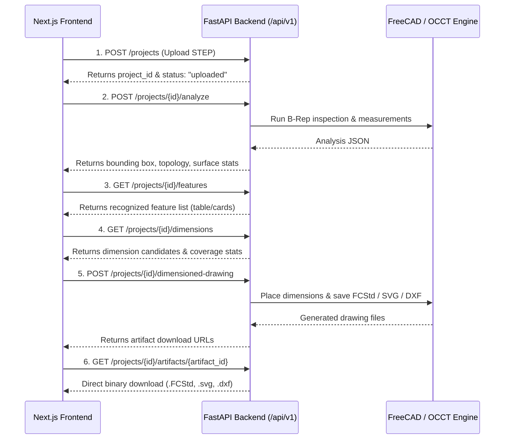

# CAD Intelligence Platform API Documentation

## Overview

The CAD Intelligence API exposes the underlying FreeCAD / OpenCASCADE deterministic CAD engine over a modern, high-performance HTTP REST API built with **FastAPI**.

* **Base URL**: `http://127.0.0.1:8000/api/v1`
* **Interactive Swagger UI**: `http://127.0.0.1:8000/docs`
* **OpenAPI Specification**: `http://127.0.0.1:8000/openapi.json`
* **CORS**: Configured for Next.js frontend at `http://localhost:3000` and `http://127.0.0.1:3000`.

---

## Starting the Server

```powershell
# Run the FastAPI server with auto-reload (using conda sales)
& "D:\anaconda\envs\sales\python.exe" -m uvicorn src.api.app:app --host 127.0.0.1 --port 8000 --reload
```

---

## API Endpoints Summary

| Method | Endpoint | Description |
|:---|:---|:---|
| `GET` | `/api/v1/health` | Service health check |
| `POST` | `/api/v1/projects` | Upload STEP file (`.step`, `.stp`) & create project workspace |
| `GET` | `/api/v1/projects/{project_id}` | Get project status and available artifacts |
| `POST` | `/api/v1/projects/{project_id}/analyze` | Execute B-Rep topology inspection & measurements |
| `GET` | `/api/v1/projects/{project_id}/features` | Get recognized CAD features (counterbores, holes, bosses, fillets) |
| `GET` | `/api/v1/projects/{project_id}/dimensions` | Get complete dimension candidate dataset and feature coverage |
| `POST` | `/api/v1/projects/{project_id}/drawings` | Generate standard 5-view TechDraw drawing (`.FCStd`, `.svg`, `.dxf`) |
| `POST` | `/api/v1/projects/{project_id}/dimensioned-drawing` | Generate complete dimensioned TechDraw drawing (Phase 9A) |
| `GET` | `/api/v1/projects/{project_id}/artifacts/{artifact_id}` | Download generated CAD artifact securely |

---

## Endpoint Details & Examples

### 1. Health Check
* **Request**: `GET /api/v1/health`
* **Response** (`200 OK`):
```json
{
  "status": "ok",
  "service": "cad-intelligence-api",
  "version": "1.0.0"
}
```

---

### 2. Upload STEP Model
* **Request**: `POST /api/v1/projects` (multipart/form-data with file field `file`)
* **Response** (`201 Created`):
```json
{
  "project_id": "8f91336f-dcb7-4fa0-a46e-42d267db121f",
  "filename": "Pieza18_1.STEP",
  "status": "uploaded",
  "created_at": "2026-08-26T07:29:45.123456+00:00"
}
```

---

### 3. Get Project Status
* **Request**: `GET /api/v1/projects/{project_id}`
* **Response** (`200 OK`):
```json
{
  "project_id": "8f91336f-dcb7-4fa0-a46e-42d267db121f",
  "filename": "Pieza18_1.STEP",
  "status": "completed",
  "created_at": "2026-08-26T07:29:45.123456+00:00",
  "updated_at": "2026-08-26T07:30:12.654321+00:00",
  "artifacts": [
    {
      "artifact_id": "dimensioned_fcstd",
      "artifact_type": "fcstd",
      "filename": "Pieza18_1_complete_dimensioned.FCStd",
      "size_bytes": 118141,
      "download_url": "/api/v1/projects/8f91336f-dcb7-4fa0-a46e-42d267db121f/artifacts/dimensioned_fcstd"
    }
  ],
  "error_message": null
}
```

---

### 4. Execute CAD Analysis
* **Request**: `POST /api/v1/projects/{project_id}/analyze`
* **Response** (`200 OK`):
```json
{
  "project_id": "8f91336f-dcb7-4fa0-a46e-42d267db121f",
  "filename": "Pieza18_1.STEP",
  "units": "mm",
  "topology": {
    "solids": 1,
    "shells": 1,
    "faces": 43,
    "edges": 103,
    "vertices": 62
  },
  "bounding_box": {
    "x_min": -35.0185,
    "x_max": 35.0185,
    "y_min": -12.0069,
    "y_max": 12.0069,
    "z_min": -0.2119,
    "z_max": 30.6591,
    "x_length": 70.0371,
    "y_length": 24.0138,
    "z_length": 30.8711
  },
  "surface_types": {
    "Cylinder": 22,
    "Plane": 8,
    "BSplineSurface": 7,
    "Toroid": 6
  },
  "feature_count": 20,
  "volume_mm3": 16856.332,
  "surface_area_mm2": 6766.739
}
```

---

### 5. Get Recognized Features
* **Request**: `GET /api/v1/projects/{project_id}/features`
* **Response** (`200 OK`):
```json
{
  "project_id": "8f91336f-dcb7-4fa0-a46e-42d267db121f",
  "total_features": 20,
  "features": [
    {
      "id": "CBORE_001",
      "type": "counterbored_hole",
      "status": "confirmed",
      "dimensions": {
        "bore_diameter": 5.5,
        "counterbore_diameter": 11.0,
        "bore_depth": 3.3,
        "counterbore_depth": 4.7452,
        "total_depth": 8.0452
      },
      "source_entities": ["Face4", "Face22", "Face5", "Face21", "Face23"],
      "axis": [0.0, 0.0, 1.0],
      "position": [0.0, 0.0, 0.0]
    },
    {
      "id": "HOLE_002",
      "type": "through_hole",
      "status": "confirmed",
      "dimensions": {
        "diameter": 10.0,
        "length": 8.5127
      },
      "source_entities": ["Face6", "Face7", "Face14", "Face15"],
      "axis": [1.0, 0.0, 0.0],
      "position": [0.0, 0.0, 15.0]
    }
  ]
}
```

---

### 6. Get Engineering Dimensions
* **Request**: `GET /api/v1/projects/{project_id}/dimensions`
* **Response** (`200 OK`):
```json
{
  "project_id": "8f91336f-dcb7-4fa0-a46e-42d267db121f",
  "total_candidates": 20,
  "placed_count": 14,
  "excluded_count": 6,
  "dimensions": [
    {
      "id": "D001",
      "type": "diameter",
      "value": 5.5,
      "display_value": "Ø5.50 mm",
      "unit": "mm",
      "semantic_role": "feature_size",
      "priority": "PRIMARY",
      "dependency_type": "independent",
      "depends_on": [],
      "source_feature": "CBORE_001",
      "source_entities": ["Face4", "Face22"],
      "status": "passed",
      "selected_view": "Top",
      "projection_status": "circular_profile",
      "placement_status": "placed",
      "x_mm": 150.0,
      "y_mm": 207.0,
      "reason": "Primary engineering dimension placed on Top view"
    }
  ],
  "feature_coverages": [
    {
      "feature_id": "CBORE_001",
      "feature_type": "counterbored_hole",
      "coverage_status": "fully_dimensioned",
      "dimension_ids": ["D001", "D002", "D015", "D016", "D017"],
      "placed_dimension_ids": ["D001", "D002", "D015", "D016"],
      "missing_aspects": ["location_coordinates"]
    }
  ]
}
```

---

### 7. Generate Complete Dimensioned TechDraw Drawing
* **Request**: `POST /api/v1/projects/{project_id}/dimensioned-drawing`
* **Response** (`200 OK`):
```json
{
  "project_id": "8f91336f-dcb7-4fa0-a46e-42d267db121f",
  "status": "completed",
  "drawing_type": "complete_dimensioned",
  "artifacts": [
    {
      "artifact_id": "dimensioned_fcstd",
      "artifact_type": "fcstd",
      "filename": "Pieza18_1_complete_dimensioned.FCStd",
      "size_bytes": 118141,
      "download_url": "/api/v1/projects/8f91336f-dcb7-4fa0-a46e-42d267db121f/artifacts/dimensioned_fcstd"
    },
    {
      "artifact_id": "dimensions_json",
      "artifact_type": "json",
      "filename": "Pieza18_1_complete_dimensions.json",
      "size_bytes": 25511,
      "download_url": "/api/v1/projects/8f91336f-dcb7-4fa0-a46e-42d267db121f/artifacts/dimensions_json"
    }
  ]
}
```

---

## Future Next.js Frontend Integration Workflow

A future Next.js frontend (e.g. at `http://localhost:3000`) can implement the following simple 6-step lifecycle:


